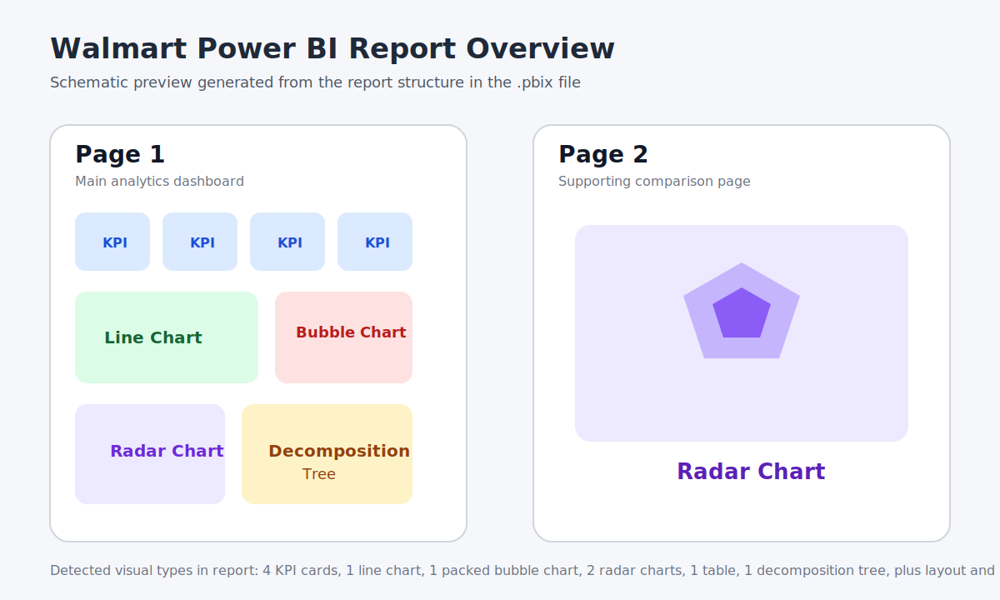

# Walmart Power BI Dashboard

## Project Type

Business Intelligence | Data Visualization | Dashboarding

## Business Problem

Business users need a simple way to monitor performance, review trends, and filter metrics without reading raw datasets.

## Objective

Create an interactive Power BI dashboard to track Walmart business performance and support quick stakeholder review.

## Preview

This is a schematic preview generated from the report structure inside the `.pbix` file. It is not a screenshot, but it reflects the report layout and major visual types detected in the project.

## Dashboard Focus

- KPI-driven view of business performance
- Interactive filters and drilldown support
- Category and trend-level insights for decision making
- Multi-page report structure for summary and supporting views

## Report Structure

- 2 report pages
- 4 KPI card visuals
- 1 line chart
- 1 packed bubble chart
- 2 radar charts
- 1 table
- 1 decomposition tree

## Skills Demonstrated

- Business intelligence reporting
- Dashboard design
- KPI presentation
- Interactive filtering
- Stakeholder-focused visualization

## Tools

- Microsoft Power BI

## Deliverable

- `capstone.pbix`
- `dashboard-overview.svg`

## Business Value

Enables stakeholders to monitor performance quickly and make data-backed operational decisions.
